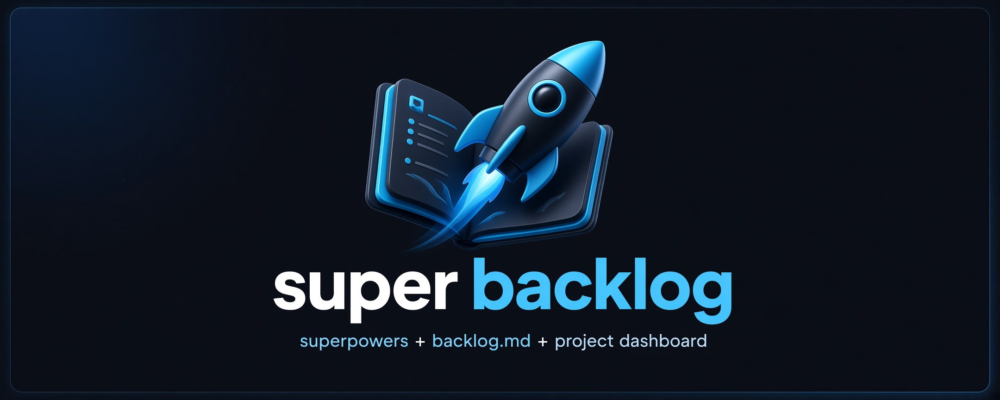
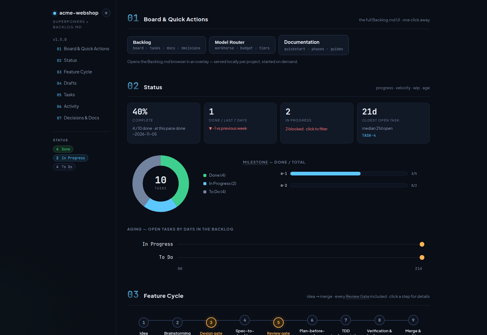

# super-backlog

[](https://github.com/adam-s-k-i/super-backlog/actions/workflows/ci.yml)
[](https://adam-s-k-i.github.io/super-backlog/)



One command to equip any project with [Backlog.md](https://github.com/MrLesk/Backlog.md) + [Superpowers](https://github.com/obra/superpowers), plus a Project Dashboard.

## What & why

Superpowers and Backlog.md are strong on their own, but nothing wires them together: Superpowers defines *how* agents should work (brainstorming → plans → TDD → review), Backlog.md defines *what* is tracked (markdown tasks, Kanban board, browser UI). Connecting them today means hand-copying glue from project to project — workflow blocks in `AGENTS.md`, bridge skills like `spec-to-backlog`, npm scripts, plugin config. super-backlog is the glue orchestrator that installs and maintains all of it in one step, with a guaranteed-clean exit path (`sbl uninstall`).

## Requirements

- Node >= 20
- A package manager (npm, pnpm, or bun) for dependency installation
- Works with **OpenCode** and **Claude Code** (both configured by default)

## Quickstart

```bash
npx super-backlog init          # install everything into the current project
npx super-backlog init --models # install + enable the optional model router
npm run board                   # open the Backlog.md kanban board
sbl dashboard --serve           # live Project Dashboard on http://localhost:6428
                                # (or: npx super-backlog dashboard --serve)
```

On Windows PowerShell, `npx super-backlog init` may fail with an execution-policy error before the CLI starts. Run `Set-ExecutionPolicy -Scope CurrentUser RemoteSigned` once in PowerShell, or run `sbl doctor` for the exact policy and fix.

`init` is idempotent — safe to re-run any time; re-running with a newer kit version is the upgrade path for all injected files.

## What gets installed

| Target | Content | Ownership model |
|---|---|---|
| `package.json` devDependencies | `backlog.md@latest` + `super-backlog@latest` | merged |
| `backlog/` | created by `backlog init --defaults` (upstream owns it) | delegated |
| `opencode.json` | `plugin[] += superpowers@git+https://github.com/obra/superpowers.git` | merged; other keys untouched |
| `.claude/` | Superpowers via official marketplace — init prints the exact command to paste (`/plugin install superpowers@claude-plugins-official`); file-based skills work immediately | instructed/delegated |
| `AGENTS.md` | `<!-- SUPER-BACKLOG:x.y.z START -->` … `<!-- SUPER-BACKLOG END -->` workflow block | marker-scoped |
| `CLAUDE.md` | one-line pointer to the AGENTS.md block | marker-scoped |
| `.opencode/skill/<skill>/SKILL.md` (3 glue skills) | skill templates | fingerprint header line |
| `.claude/skills/<skill>/SKILL.md` | same templates | fingerprint header line |
| `package.json` scripts | `tasks` → `backlog task list`, `board` → `backlog board`, `browser` → `backlog browser`, `dashboard` → `super-backlog dashboard` (never overwrite existing values) | merged, add-only-if-absent |
| `dashboard.html` | generated Project Dashboard | regenerated wholesale |
| `.git/hooks/post-commit` | dashboard freshness block — regenerates `dashboard.html` after commits that touch `backlog/` (default; opt out with `--no-refresh-hook`) | appended marker block |
| `.git/hooks/pre-commit` | integrity guard hook — only with `--guard` (opt-in) | appended marker block |

Commands: `sbl init` · `sbl models` · `sbl doctor` · `sbl uninstall [--with-backlog]` · `sbl update` · `sbl dashboard [--serve] [--port <n>] [--no-open] [--out <file>]`. See `sbl help` for every flag.

## Model router (opt-in)

`sbl init --models` adds an optional model router that routes simple work to cheaper model tiers while keeping your main model for complex tasks.

```bash
sbl init --models              # install router + harness adapters
sbl models enable              # turn routing on
sbl models disable             # turn routing off
sbl models show                # inspect current config
sbl models discover            # discover available OpenCode models
```

When enabled:

- **OpenCode** — the plugin `sbl-model-router.js` rewrites `chat.params` for the `sbl-worker` (workhorse) and `sbl-worker-cheap` / `explore` (budget) agents.
- **Claude Code** — agent files carry a `model:` placeholder that is updated by a `SessionStart` hook based on your current main model.
- **Dashboard** — `sbl dashboard --serve` exposes `/api/models` and `/api/models/discover`.

The router is fully owned by super-backlog and removed by `sbl uninstall`. See the [model router design](docs/superpowers/specs/2026-08-26-sbl-model-router-design.md) for details.

## Project Dashboard

`sbl dashboard` generates a single self-contained `dashboard.html`: a dark, HTS-style cockpit rendered from your Backlog data in seven sections — Board & Quick Actions, Status (donut), Milestones, Tasks (sortable/filterable table with a click-in detail panel per task), Feature Cycle (pipeline stepper), Activity (30-day sparkline), and Decisions & Docs. A layered dependency graph maps task `depends-on` relations (cycle- and dangling-ref-tolerant): hover highlights edges, click opens the task. Glossary tooltips explain domain terms inline; extend or override them project-wide via `backlog/docs/glossary.md` (`## Term` heading plus the text below it). No CDNs, no external fonts — works offline, diffs cleanly in git, hostable anywhere. Use `--serve` for live mode: it watches `backlog/`, regenerates on change, and serves on port 6428 by default.

### Keeping it fresh

By default `init` installs a `post-commit` hook block that regenerates `dashboard.html` whenever the commit touched `backlog/`. The block is marker-delimited, so it composes with the guard hook and foreign hook content, `uninstall` removes exactly that block, and `update` refreshes it. It never blocks a commit: failures print a one-line stderr note and the exit status stays 0. Opt out with `--no-refresh-hook`.



## Uninstall guarantee

super-backlog uninstall removes only provably owned artifacts and keeps your Backlog task data unless you pass --with-backlog. Every removal decision is reported line by line as removed / kept / skipped; files whose ownership cannot be proven are left untouched.

## Harness support

- **OpenCode** — native: `opencode.json` plugin entry plus file-based skills under `.opencode/skill/` (spec-to-backlog, backlog-status-report, task-review-gate).
- **Claude Code** — file-based skills under `.claude/skills/` always work immediately; the marketplace plugin cannot be installed from a script, so init prints the exact command to paste (`/plugin install superpowers@claude-plugins-official`) and exits with a warning (exit code 4).

Details and matrix: [docs/guide/harness-support.md](docs/guide/harness-support.md).

## Troubleshooting

Windows OpenCode fallback, exit codes, and environment seams: [docs/guide/troubleshooting.md](docs/guide/troubleshooting.md). Architecture deep-dive: [docs/guide/architecture.md](docs/guide/architecture.md). Guard hook details: [docs/guide/guard.md](docs/guide/guard.md).

## Development

```bash
npm ci          # install dependencies
npm test        # build + vitest suite
npm run lint    # markdownlint + cspell over all Markdown
```

## License

[MIT](LICENSE)
