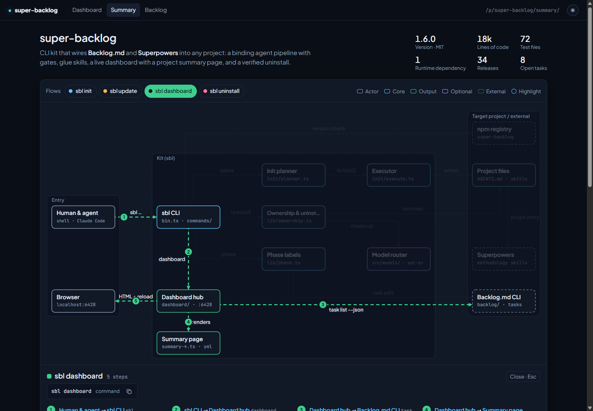

# Project summary page

Every project registered with the dashboard hub gets a second page next to the
dashboard: a management summary at `/p/<slug>/summary/`. The dashboard is about
work in progress; the summary answers what the project is, how it is built and
where the open work sits.

## Open the page

```bash
sbl dashboard
```

Use the **Summary** tab under the project name in the dashboard sidebar, or open
`http://localhost:6428/p/<slug>/summary/` directly. The summary page has tabs
back to the **Dashboard** and to the full-page **Backlog** browser. Both pages
share the theme toggle and reload automatically when anything under `backlog/`
changes, including the architecture file. On Windows under Node 24 live reload
is disabled due to a libuv bug, as for the dashboard (see
[Troubleshooting](troubleshooting.md#windows--node-24-sbl-dashboard-disables-live-reload));
refresh the browser tab manually.



## What the page shows

The page combines two sources and says which block came from where (the
collapsible **Data source** section at the bottom).

- **Automatic facts**, computed by the hub on every regenerate: name, version
  and license from `package.json`, `composer.json` or a WordPress theme/plugin
  header; lines of code and test files; runtime and development dependencies;
  releases (git tags such as `v1.2.0`); CI workflows; open tasks from the
  backlog; commands from the manifest scripts.
- **Curated content** from `backlog/docs/architecture.yml`: a one-paragraph
  pitch, an architecture diagram with zones, components and labelled
  connections, flows that walk through the diagram step by step, numbered
  highlights, the tech stack with the role of each package, grouped commands,
  and a mapping from open tasks to components.

Without the curated file the page shows a reduced view: the facts, all open
tasks, the manifest commands and the tech stack from the manifests, plus a
notice that explains how to add the file.

## Create the architecture file

Let your agent write it. `sbl init` and `sbl update` install the
`architecture-summary` skill for Claude Code and OpenCode. Ask for "an
architecture summary of this project"; the skill reads manifests, layout and
tests, writes `backlog/docs/architecture.yml`, runs `sbl doctor` until the file
is clean and stops for your review. While the file is missing, `sbl init` ends
with a hint to ask your agent for it.

To check the file yourself:

```bash
sbl doctor
```

Check 5 validates `backlog/docs/architecture.yml`. It is skipped when the file
does not exist, fails with every problem and its path when the file is invalid,
and warns when the file is valid but the diagram cannot be drawn cleanly
(an edge without a straight or single-corner route, an overlapping label, or a
crossing).
On a valid file, check 5 also counts the drift findings described in
[Keeping it current](#keeping-it-current) and points to `sbl summary`.

## File format

A minimal file:

```yaml
schema: 1
pitch: A **small** service that turns uploads into reports.
grid: { cols: 3, rows: 2 }
nodes:
  - { id: api, label: Upload API, kind: core, cell: [0, 0] }
  - { id: store, label: Report store, kind: output, cell: [2, 0] }
  - { id: mail, label: Mail relay, kind: external, cell: [2, 1] }
edges:
  - { from: api, to: store, label: writes }
  - { from: store, to: mail, label: notifies }
```

| Key | Required | Content |
| --- | --- | --- |
| `schema` | yes | Always `1`. |
| `pitch` | yes | At most 400 characters. `**bold**` is the only markup. |
| `grid` | yes | `{ cols, rows }`, 2 to 8 each. Nodes sit on grid cells. |
| `kinds` | no | Map of kind id to `{ label, color, dashed? }`; replaces the default kinds `actor`, `core`, `output`, `optional`, `external`. At most 6. |
| `zones` | no | Up to 16 `{ label, cols: [c0, c1], rows: [r0, r1] }`, inclusive cell ranges that may not overlap. |
| `nodes` | yes | At least 2, at most 40: `id`, `label` (28 characters), `kind`, `cell: [col, row]`, optional `sub`, `purpose`, `why`, `files`, `commands` (`{ run, note? }`). |
| `edges` | yes | At least 1, at most 120: `{ from, to, label, text? }`. Read as "from → label → to"; the arrow points at the target. |
| `flows` | no | Up to 12 `{ id, label, color?, command?, text?, steps }` with up to 12 steps each, every step `from>to` naming an existing edge. |
| `highlights` | no | Up to 12 `{ node, title, text }`; the list position is the badge number on the node, one badge per node. |
| `stack` | no | Up to 40 `{ name, group, package?, version?, role?, nodes }`. Versions resolve from `package-lock.json` or `composer.lock` unless `version` is set. |
| `commands` | no | Map of group name to `{ run, note? }` entries; at most 6 groups of 8. |
| `tasks` | no | Map of task id to node id; shows open tasks on their component. |

Identifiers (`id`, kind keys, flow ids) match `^[a-z][a-z0-9-]{0,31}$`. Colors
are one of `accent`, `ok`, `warn`, `violet`, `rose`, `muted`, `dim`. The file
may be at most 256 KB.

### YAML subset

The file is YAML, read by a small built-in parser instead of a full YAML
library:

- block mappings and sequences with two-space indentation;
- single-line flow collections `[a, b]` and `{ k: v }`; a flow mapping may hold
  a flow sequence (`cell: [0, 1]`), but no deeper nesting;
- plain, single-quoted and double-quoted scalars, integers, `true`/`false`,
  `>` and `|` block scalars, and `#` comments.

Quote a value when it contains a comma inside `{ }` or `[ ]`, a colon followed
by a space, or a `#`. Tabs, anchors, aliases, tags and multiple documents are
rejected with the line and column of the problem.

## Keeping it current

`sbl summary` compares the curated file with the code and the backlog:

```bash
sbl summary
```

It validates the file like doctor check 5, lists schema and layout warnings,
and then lists four kinds of drift, each with its path in the file:

| Finding | Meaning |
| --- | --- |
| `missing-path` | A path in a node's `files` no longer exists. An entry that ends in `/` must be a directory. |
| `done-task` | A `tasks` entry maps a task that is Done. |
| `unknown-task` | A `tasks` entry names a task the backlog no longer lists (archived, deleted or never created). |
| `stale-file` | 20 or more commits changed the documented files since the file was last committed. |

The last line names the prompt to hand to your agent, for example
"Run the architecture-summary skill to refresh backlog/docs/architecture.yml;
sbl summary lists the drift findings." When the backlog CLI or git is
unavailable, the affected checks are skipped and a `note:` line says why.

| Situation | Exit code |
| --- | --- |
| Valid file, no warnings, no drift | `0` |
| Missing file, warnings, or drift | `4` |
| Invalid file, or not inside a project | `1` |

`sbl summary --check` prints the same report without the prompt and uses the
same exit codes, for CI and for the agent's end-of-pipeline check. The
workflow block asks the agent to run it after a merge and to offer a refresh
when it reports drift; the agent never runs the skill without your consent.

The summary page shows the same information as a banner with the number of
findings and a copy button for the prompt.

## When something is wrong

- **No file:** the reduced view plus a notice with a copy button for the
  agent prompt that creates the file.
- **Drift:** the full page plus a banner with the number of drift findings
  and a copy button for the refresh prompt; `sbl summary` lists them.
- **Invalid file:** the reduced view plus a notice that lists up to 20 problems
  as `path: message`, for example `nodes[3].cell: outside grid 5x5`. The page
  never fails to load.
- **Unexpected render error:** the reduced view with the error message. The
  dashboard is never affected.
- **Warnings only:** the full page; the warnings appear in **Data source**.
